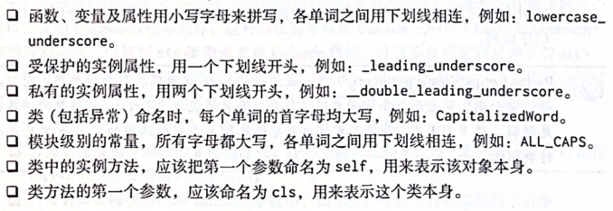
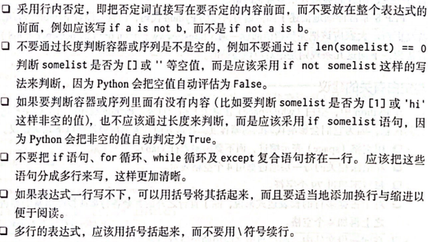

# 遵循PEP8风格指南
网址：https://peps.python.org/pep-0008/
### 与空白有关的建议
1. 用空格表示缩进，不要使用制表符（tab）
2. 每行不超过79个字符
3. 和语法相关的每一层缩进使用4个空格
4. 对于占据多行的长表达式，除了首行之外的其余各行都应该在通常的缩进级别之上再加4个空格
5. 在同一份文件中，函数与类之间用两个空行隔开
6. 在同一个类中，方法之间用一个空行隔开

### 与命名有关的建议
1. 变量名、函数名和函数/方法参数应该小写，并且单词之间用下划线连接
2. 类名使用驼峰命名法，首字母大写

### 与表达式和语句有关的建议
